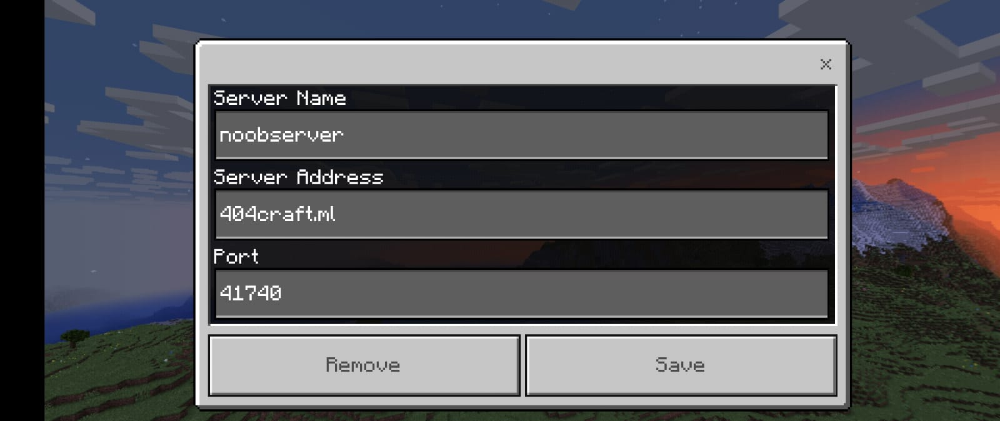

## How to join our Server
Download Minecraft apk-1.18.20.23  
Given below is list of options where you can download from .Click on your prefferd option to download 
1.[GOOGLE-DRIVE](https://drive.google.com/uc?id=1P0U0slvLNr5q0M7mLcP_sYRaPw_DAFAf&export=download). 
2.[Mega](https://mega.nz/file/fQQzCCjA#54RTGtF2Zr6EyT1Y9rCg-oaTUGIMjynRppFsQeYCveM). 
3.[apkadmin](https://apkadmin.com/82gwhgl9q7rj/Minecraft_1.18.2.03___40_Full__41_.apk.html). 
4.[Telegram](https://t.me/play_minecraft_hemkers/3). 

### Set-up Voice Chat

Download Discord [CLICK-HERE](https://play.google.com/store/apps/details?id=com.discord) 
 
Discord server isnt active yet . sorry for the inconviniance 

### JOIN THE SERVER 
Open Minecraft app and Click on Play.
 
On top side you will see 3 options <b>WORLDS--FRIENDS--SERVERS<b> 
   CLICK ON SERVERS. 
  
   
   
   
  <b>Click on ADD Server BUTTON</b>
    
   
   
   
    
   
   
   
  <b>ADD any name to SERVER according  to your wish
     
    ON SERVER IP type in <code>404craft.ml</code>
     
    On port type in <code>41740</code>
     
    Type everything Accordingly as Given Below
    </b>
   
    
  </img>
 
  Discord Server Will be set up Soon.

