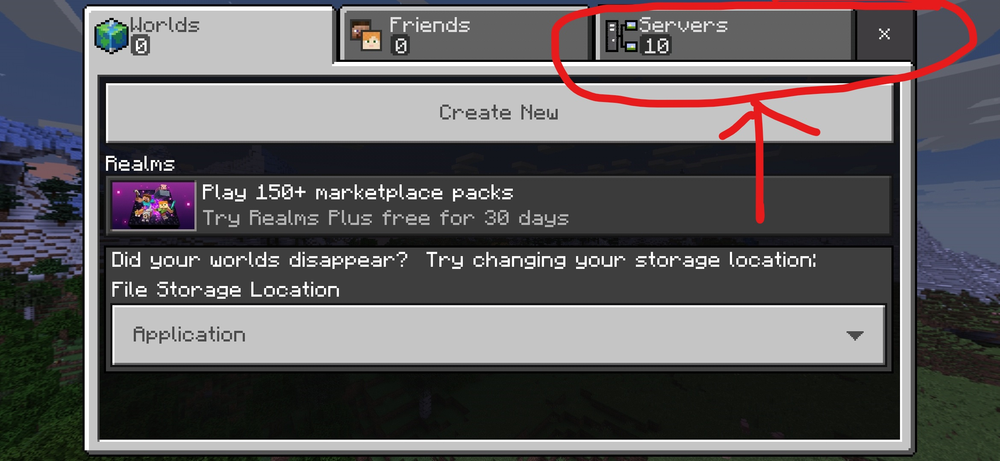
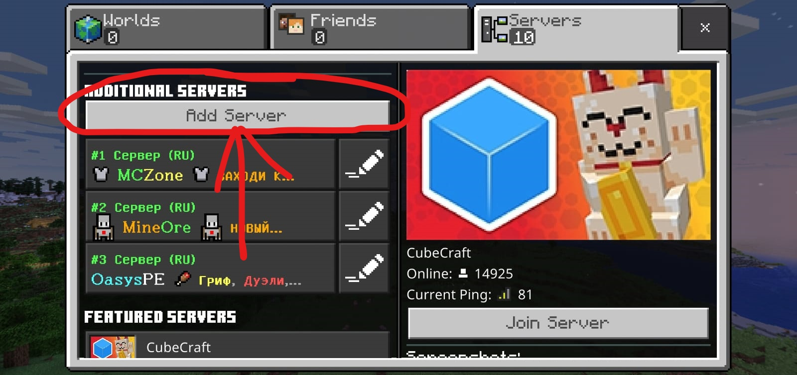
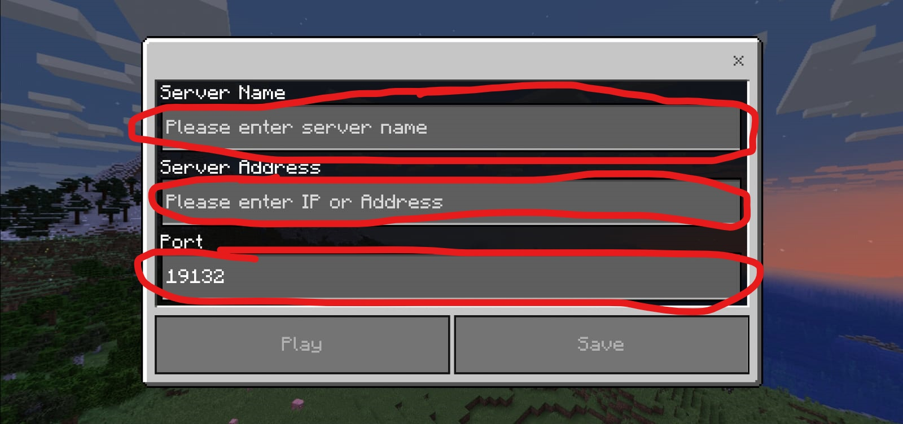
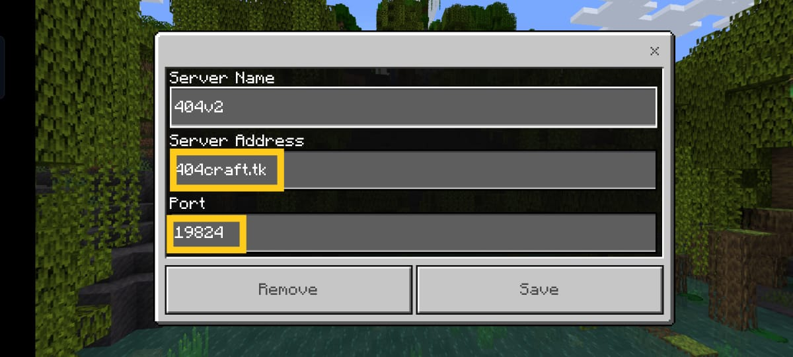

## How to join our Server
Download Minecraft apk-1.19.1  
Given below is list of options where you can download from .Click on your prefferd option to download 
1.[Apkadmin](https://apkadmin.com/cb0b8yevox76/Minecraft_1.19.10.03___40_Full__41_.apk.html). 
2.[GOOGLE-DRIVE](https://drive.google.com/uc?id=1PxLG2YSI-SWUqbEYQLdj1WBHl43cMi0m&export=download). 
3.[Telegram](https://t.me/apks_404_gaming). 

### Set-up Voice Chat

Download Discord [CLICK-HERE-TO-DOWNLOAD-DISCORD](https://play.google.com/store/apps/details?id=com.discord) 
 
Discord server isnt fully active  . YOU can still join and use VOICE CHANNELS
 
[CLICK-TO-JOIN-DISCORD](https://404craft.cf/discord.html)

### JOIN THE SERVER 
Open Minecraft app and Click on Play.
 
On top side you will see 3 options <b>WORLDS--FRIENDS--SERVERS<b> 
   CLICK ON SERVERS. 
  
   
   
   
  <b>Click on ADD Server BUTTON</b>
    
   
   
   
    
   
   
   
  <b>ADD any name to SERVER according  to your wish
     
    ON SERVER IP type in <code>404craft.tk</code>
     
    On port type in <code>19824</code>
     
    Type everything Accordingly as Given Below
    </b>
   
    
  
 
  Discord Server Does'nt Have any active Bot's To turn on and off server . The bot is under development stage contact admin for bot usage and testing purposes . 

